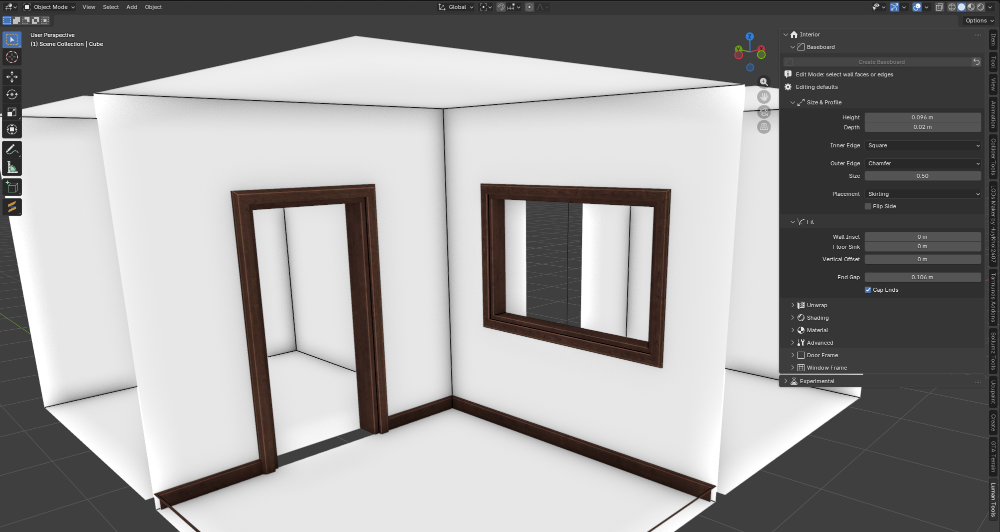

# Luman Tools

A Blender add-on for GTA V modding. All the tools sit in one sidebar tab.

## Interior

Baseboards, door frames and window frames. Pick the walls, press one button, and
you get a separate mesh with clean corners, finished UVs and a material on it.

**View3D → Sidebar (N) → Luman Tools → Interior**

| | Select | You get |
|---|---|---|
| **Baseboard** | wall faces, or the edges where wall meets floor | a baseboard along them — at the floor, or up at the ceiling |
| **Door Frame** | the 6 edges around a doorway, on both sides of the wall | a frame around the opening, corners cut at 45° |
| **Window Frame** | the 4 edges around a window, on one side of the wall | a frame on that side; **Mirror** adds the one on the other side |

Sizes, shape and fit are all in the panel: height and depth, the shape of both
edges (square, chamfer, bullnose, cove, ogee, stepped, or a profile you type in
yourself), where it sits on the wall, texture scale, shading and the material.
Drag a slider and the mesh rebuilds right away — the wall itself is never touched.

## Install

[Download the latest release](https://github.com/LumanGH/luman-tools/releases/latest)

1. Download the ZIP from the release — do not unpack it.
2. Blender → **Edit → Preferences → Add-ons → Install from Disk** → pick the ZIP.
3. Enable **Luman Tools**.
4. Press **N** in the 3D viewport → **Luman Tools** tab.

Requires Blender 4.2 or newer.
